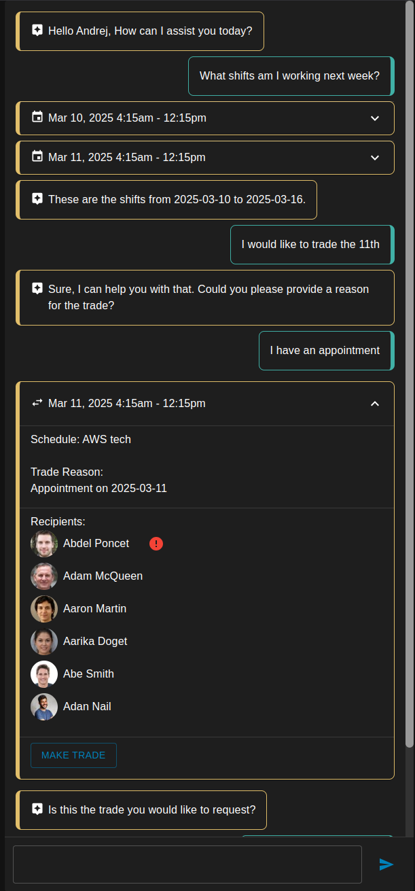

# Intro
Your challenge is to build this chat experience.
The UI framing will be provided for you, but you have to build the backend.
There are various pieces missing which you have to build, use your intuition.

https://platform.humanity.com/reference

## General Parameters
- Demonstrate your knowledge of language models.
- Demonstrate your ability to identify hidden problems and solve them.
- Demonstrate your knowledge of lang-chain and DSPy
- Demonstrate prompt optimization with DSPy

## User Stories
### Use Case 1
As a user, I would like to look at what shifts I'm working this week or next week.

### Use Case 2
As a user, I would like to request a trade for a shift in the future.
I would like view the trade request details before saving.

### Use Case 3
As a user, I would like to request time off for a day in the future.
I would like to view the time off request details before saving.

### Use Case 4 (bonus)
As an admin, I would like to create a shift.

## Example Screenshot

